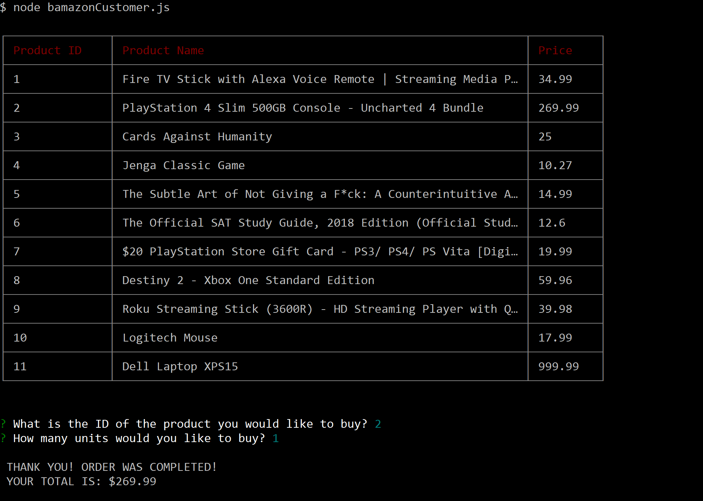
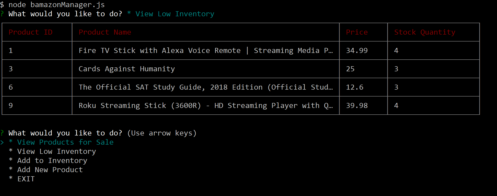
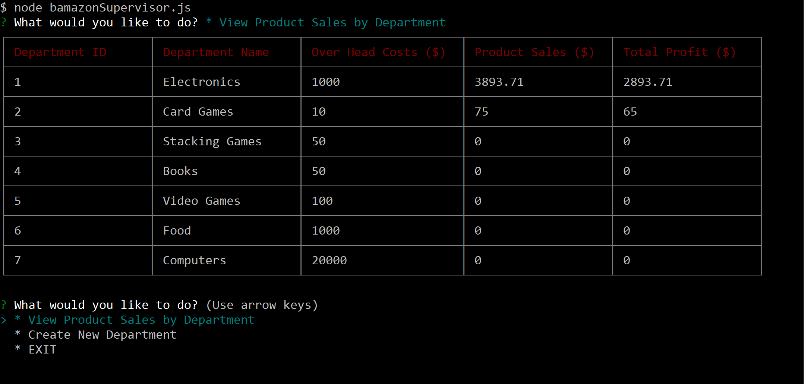

# Bamazon

> An Amazon-like storefront with MySQL

## Customer View

1. Running this application will first display all of the items available for sale. Include the ids, names, and prices of products for sale.

2. The app should then prompt users with two messages.
  - The first should ask them the ID of the product they would like to buy.
  - The second message should ask how many units of the product they would like to buy.

3. Once the customer has placed the order, the application should check if the store has enough of the product to meet the customer's request.

  - If not, the app should log a phrase like "Insufficient quantity!", and then prevent the order from going through.  
  - However, if the store does have enough of the product, the application should fulfill the customer's order.

4. Once the order goes through, the application shows the customer the total cost of their purchase.

## Manager View

Running this application will list a set of menu options:
- View Products for Sale
- View Low Inventory
- Add to Inventory
- Add New Product

1. If a manager selects View Products for Sale, the app should list every available item: the item IDs, names, prices, and quantities.
2. If a manager selects View Low Inventory, then it should list all items with an inventory count lower than five.

3. If a manager selects Add to Inventory, your app should display a prompt that will let the manager "add more" of any item currently in the store.

4. If a manager selects Add New Product, it should allow the manager to add a completely new product to the store.

## Supervisor View

Running this application will list a set of menu options:
- View Product Sales by Department
- Create New Department

When a supervisor selects View Product Sales by Department, the app should display a summarized table in their terminal/bash window.
